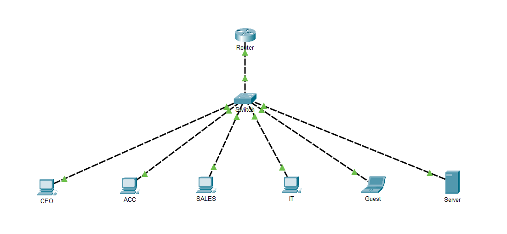

# Enterprise Network Lab

A Cisco Packet Tracer enterprise network project demonstrating VLAN segmentation, Router-on-a-Stick, DHCP, Inter-VLAN Routing, and Access Control Lists (ACLs).

This project was created as part of my networking portfolio to demonstrate practical Cisco networking skills through implementation, verification, and documentation.

---

## Project Overview

This lab simulates a small enterprise network with multiple departments connected through a Layer 2 switch and a Cisco router.

Each department is isolated using VLANs while controlled communication is provided through Router-on-a-Stick routing. DHCP automatically assigns IP addresses, and an Extended ACL protects internal resources from the Guest network.

---

## Features

- VLAN Segmentation
- Router-on-a-Stick
- Inter-VLAN Routing
- DHCP Configuration
- Extended ACL
- Enterprise IP Addressing
- Verification Documentation
- Troubleshooting Guide
- Cisco IOS Configuration Backups
- Spanning Tree Protocol (PVST)
- PortFast
- BPDU Guard

---

## Technologies Used

| Technology | Purpose |
|------------|---------|
| Cisco Packet Tracer | Network Simulation |
| Cisco IOS | Router & Switch Configuration |
| VLAN | Network Segmentation |
| IEEE 802.1Q | VLAN Trunking |
| DHCP | Automatic IP Assignment |
| ACL | Traffic Filtering |
| Git & GitHub | Version Control & Documentation |

---

## Network Topology



---

## VLAN Structure

| VLAN | Department | Network |
|------|------------|----------------|
| 10 | CEO | 192.168.10.0/24 |
| 20 | Accounting | 192.168.20.0/24 |
| 30 | Sales | 192.168.30.0/24 |
| 40 | IT | 192.168.40.0/24 |
| 50 | Guest | 192.168.50.0/24 |

---

## Repository Structure

```text
Enterprise-Network-Lab/

configs/
docs/
diagrams/
packet-tracer/
screenshots/

README.md
CHANGELOG.md
PROJECT-ROADMAP.md
LICENSE
```

---

## Project Documentation

| Document | Description |
|----------|-------------|
| Project Overview | Project goals and objectives |
| Network Topology | Physical and logical topology |
| IP Addressing | Addressing plan |
| DHCP | DHCP configuration |
| VLAN | VLAN implementation |
| Router-on-a-Stick | Inter-VLAN routing |
| ACL | Guest network isolation |
| Troubleshooting | Issues encountered and solutions |

Complete documentation is available in the **docs/** directory.

---

## Verification

The project includes verification using Cisco IOS commands.

Examples include:

- show vlan brief
- show interfaces trunk
- show ip interface brief
- show ip route
- show ip dhcp binding
- show access-lists
- ping
- tracert

Verification screenshots are available in the **screenshots/** directory.

---

## Current Version

**v1.0.0**

Implemented:

- VLANs
- DHCP
- Router-on-a-Stick
- Inter-VLAN Routing
- ACL
- Documentation
- Troubleshooting
- Configuration Backups

---

## Future Improvements

Planned features include:

- SSH Management
- Management VLAN
- Port Security
- Syslog
- NTP
- Active Directory
- Windows Server
- VPN
- Docker Services
- Monitoring (Grafana & Zabbix)

See **PROJECT-ROADMAP.md** for details.

---

## Learning Objectives

This project demonstrates practical experience with:

- Enterprise network design
- Cisco IOS configuration
- Layer 2 switching
- Layer 3 routing
- Network segmentation
- DHCP deployment
- Access Control Lists
- Network troubleshooting
- Technical documentation
- GitHub project organization

---

## Author

GitHub: **YourGitHubUsername**

---

## License

This project is licensed under the MIT License.

See the LICENSE file for details.
