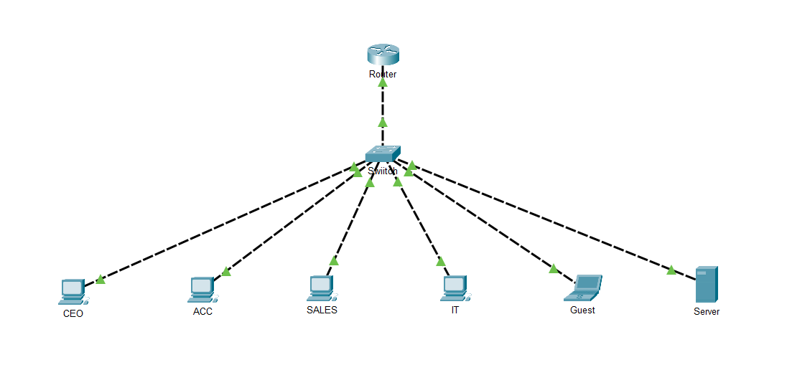

# Enterprise Network Lab

A Cisco Packet Tracer and Microsoft Windows Server enterprise lab demonstrating enterprise networking, Active Directory Domain Services (AD DS), DNS, DHCP, VLAN segmentation, Router-on-a-Stick, Access Control Lists (ACLs), centralized logging, and enterprise network management.

This project combines Cisco networking technologies with Microsoft enterprise infrastructure to simulate a real-world hybrid enterprise environment.

---

## Project Overview

This lab simulates a small enterprise network with multiple departments connected through a Layer 2 switch and a Cisco router.

Each department is isolated using VLANs while controlled communication is provided through Router-on-a-Stick routing. DHCP automatically assigns IP addresses, and an Extended ACL protects internal resources from the Guest network.

---

## Features

### Cisco Networking

- VLAN Segmentation
- Router-on-a-Stick
- Inter-VLAN Routing
- DHCP
- Extended ACL
- SSH Management
- Management VLAN
- Port Security
- Spanning Tree (PVST)
- PortFast
- BPDU Guard
- NTP
- Centralized Syslog

### Microsoft Infrastructure

- Windows Server 2022
- Active Directory Domain Services
- Domain Controller
- DNS Server
- Enterprise Authentication
- Active Directory Domain Services (AD DS)
- Active Directory Administration

### Project

- Enterprise IP Addressing
- Verification Documentation
- Troubleshooting Guide
- Cisco IOS Configuration Backups

---

## Technologies Used

| Technology | Purpose |
|------------|---------|
| Cisco Packet Tracer | Network Simulation |
| Cisco IOS | Router & Switch Configuration |
| Windows Server 2022 | Enterprise Infrastructure |
| Active Directory | Identity Management |
| DNS | Name Resolution |
| VLAN | Network Segmentation |
| IEEE 802.1Q | VLAN Trunking |
| DHCP | Automatic IP Assignment |
| ACL | Traffic Filtering |
| Git & GitHub | Version Control |
| Windows Server 2022 | Active Directory Services |

---

## Network Topology



---

## VLAN Structure

| VLAN | Department | Network |
|------|------------|----------------|
| 10 | CEO | 192.168.10.0/24 |
| 20 | Accounting | 192.168.20.0/24 |
| 30 | Sales | 192.168.30.0/24 |
| 40 | IT | 192.168.40.0/24 |
| 50 | Guest | 192.168.50.0/24 |

---

## Repository Structure

```text
Enterprise-Network-Lab/

configs/
docs/
diagrams/
packet-tracer/
screenshots/

README.md
CHANGELOG.md
PROJECT-ROADMAP.md
LICENSE
```

---

## Project Documentation

| Document | Description |
|----------|-------------|
| 01-project-overview.md | Project goals and architecture |
| 02-network-topology.md | Physical and logical network topology |
| 03-ip-addressing.md | Enterprise IP addressing plan |
| 04-vlan-configuration.md | VLAN implementation |
| 05-dhcp-configuration.md | DHCP configuration |
| 06-router-on-a-stick.md | Inter-VLAN routing |
| 07-access-control-lists.md | Extended ACL implementation |
| 08-verification-and-testing.md | Network verification and testing |
| 09-ssh-management.md | Secure SSH remote management |
| 10-management-vlan.md | Dedicated management VLAN |
| 11-port-security.md | Layer 2 port security |
| 12-spanning-tree.md | PVST, PortFast and BPDU Guard |
| 13-network-time-protocol.md | Network time synchronization (NTP) |
| 14-syslog.md | Centralized Syslog logging |

Complete technical documentation is available in the **docs/** directory.

---

## Verification

The project includes verification using Cisco IOS commands.

Examples include:

- show vlan brief
- show interfaces trunk
- show ip interface brief
- show ip route
- show ip dhcp binding
- show access-lists
- ping
- tracert

Verification screenshots are available in the **screenshots/** directory.

---

## Current Version

## Current Version

**v2.1.0**

Implemented:

### Cisco

- VLANs
- DHCP
- Router-on-a-Stick
- ACL
- SSH
- Management VLAN
- Port Security
- STP
- NTP
- Syslog

### Microsoft

- Windows Server 2022
- Active Directory
- DNS
- Domain Controller
- Organizational Units (OU)
- Security Groups
- Active Directory User Administration

### Documentation

- Verification
- Troubleshooting
- Configuration Backups

---

## Future Improvements

Planned features include:

- Windows Client Domain Join
- Group Policy
- Windows DHCP
- File Services
- VPN
- Docker
- Reverse Proxy
- Monitoring
- Grafana
- Zabbix

See **PROJECT-ROADMAP.md** for details.

---

## Learning Objectives

This project demonstrates practical experience with:

- Enterprise network design
- Cisco IOS configuration
- Layer 2 switching
- Layer 3 routing
- Network segmentation
- DHCP deployment
- Access Control Lists
- Network troubleshooting
- Technical documentation
- GitHub project organization

---

## Author

GitHub: **YourGitHubUsername**

---

## License

This project is licensed under the MIT License.

See the LICENSE file for details.
