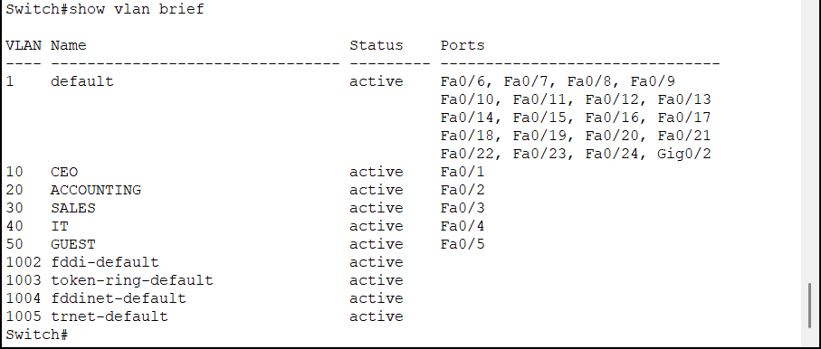
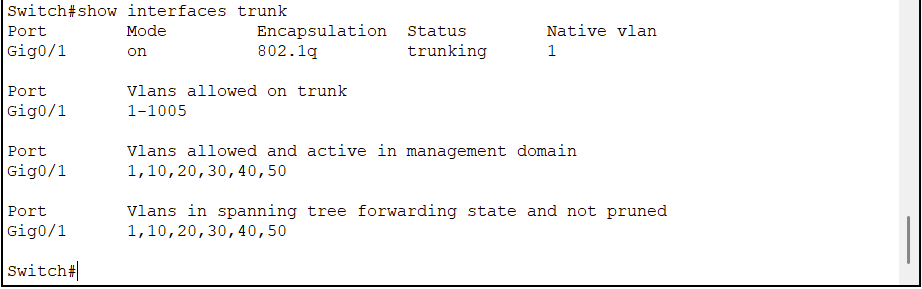

# VLAN Configuration

## Objective

This document describes the implementation of Virtual Local Area Networks (VLANs) within the enterprise network.

VLANs are used to logically separate departments while allowing all devices to share the same physical switch infrastructure.

---

## Background

By default, all switch ports belong to the same broadcast domain.

As the number of devices grows, broadcast traffic increases, reducing network efficiency and making security more difficult to manage.

VLANs divide a single physical switch into multiple logical networks.

Each VLAN operates as an independent Layer 2 broadcast domain.

---

## VLAN Design

The enterprise network is divided into five departments.

| VLAN ID | Department | Purpose |
|----------|------------|----------|
| 10 | CEO | Executive Management |
| 20 | Accounting | Financial Department |
| 30 | Sales | Sales Department |
| 40 | IT | IT Administration |
| 50 | Guest | Guest Network |

Each department is assigned its own dedicated VLAN to improve organization, security, and scalability.

---

## Port Assignment

| Switch Port | VLAN | Connected Device |
|--------------|------|------------------|
| Fa0/1 | 10 | CEO PC |
| Fa0/2 | 20 | Accounting PC |
| Fa0/3 | 30 | Sales PC |
| Fa0/4 | 40 | IT PC |
| Fa0/5 | 50 | Guest PC |
| Gig0/1 | Trunk | Router |

---

## Design Decisions

### Why VLANs?

Using VLANs provides several advantages:

- Reduces broadcast traffic
- Improves security
- Simplifies network administration
- Enables logical separation without additional switches
- Supports future network expansion

---

### Why dedicate one VLAN per department?

Each department has different security and communication requirements.

Separating departments into individual VLANs allows network policies to be applied independently.

---

### Why is the Guest network isolated?

Guest devices should not have unrestricted access to internal company resources.

A dedicated Guest VLAN allows security policies to restrict communication with internal departments.

This isolation is enforced later using Access Control Lists (ACLs).

---

## Access Ports

All end devices are connected using access ports.

Each access port belongs to only one VLAN.

Example configuration:

```cisco
interface FastEthernet0/1

switchport mode access

switchport access vlan 10
```

---

## Trunk Port

The switch connects to the router using a trunk link.

The trunk carries traffic for multiple VLANs simultaneously by tagging Ethernet frames using IEEE 802.1Q.

Current trunk:

| Interface | Mode |
|------------|------|
| Gig0/1 | 802.1Q Trunk |

---

## Verification

The following commands were used to verify the VLAN implementation:

```bash
show vlan brief

show interfaces trunk

show running-config
```

Successful verification confirmed:

- VLANs were created successfully.
- Switch ports were assigned correctly.
- The trunk link was operational.
- End devices belonged to the correct VLAN.

---

## Verification Evidence

### VLAN Table



Figure 1 — Output of the `show vlan brief` command confirming that all VLANs were created successfully and assigned to the correct access ports.

---

### Trunk Status



Figure 2 — Output of the `show interfaces trunk` command verifying that the IEEE 802.1Q trunk is operational.

---

## Troubleshooting

During implementation, the following checks were performed:

- Verified VLAN creation.
- Verified port assignments.
- Confirmed trunk status.
- Confirmed VLAN propagation across the trunk.
- Verified communication through Inter-VLAN Routing.

---

## Commands Used

```cisco
vlan 10
 name CEO

vlan 20
 name ACCOUNTING

vlan 30
 name SALES

vlan 40
 name IT

vlan 50
 name GUEST

interface FastEthernet0/1
 switchport mode access
 switchport access vlan 10

...

interface GigabitEthernet0/1
 switchport mode trunk
```

---

## Lessons Learned

Implementing VLANs is not only about creating logical networks.

Proper VLAN planning improves security, scalability, and network organization.

Separating departments before configuring routing and security policies makes future network management significantly easier.

---

## References

- IEEE 802.1Q Standard
- Cisco VLAN Configuration Guide
- Cisco Enterprise Campus Design Guide
