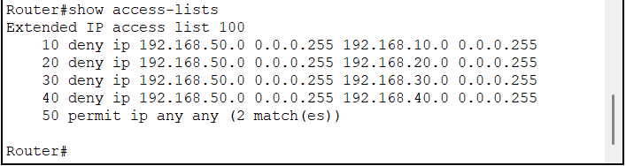
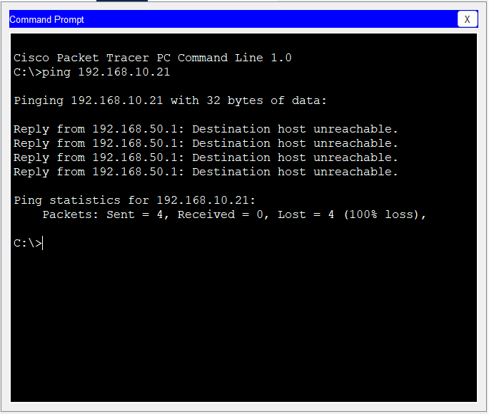

# Access Control Lists (ACL)

## Objective

This document describes the implementation of Extended Access Control Lists (ACLs) used to restrict communication between the Guest VLAN and internal company departments.

The ACL improves network security by preventing unauthorized access while allowing normal communication where appropriate.

---

## Background

By default, Router-on-a-Stick allows communication between all VLANs.

Although this behavior enables connectivity, it is not suitable for enterprise environments where different departments require different levels of access.

Access Control Lists provide a method for filtering network traffic based on predefined security policies.

---

## Security Requirement

The Guest network must not be able to access internal company resources.

Guest devices are allowed to communicate only within their own subnet and use the default gateway.

Communication to the following departments is denied:

- CEO
- Accounting
- Sales
- IT

---

## ACL Design

The ACL is applied inbound on the Guest VLAN subinterface.

This ensures that unwanted traffic is blocked as soon as it enters the router.

Applying the ACL close to the traffic source reduces unnecessary processing and follows Cisco best practices.

---

## ACL Rules

| Source | Destination | Action |
|---------|-------------|--------|
| Guest VLAN | CEO | Deny |
| Guest VLAN | Accounting | Deny |
| Guest VLAN | Sales | Deny |
| Guest VLAN | IT | Deny |
| Any | Any | Permit |

---

## Configuration

Example configuration:

```cisco
access-list 100 deny ip 192.168.50.0 0.0.0.255 192.168.10.0 0.0.0.255
access-list 100 deny ip 192.168.50.0 0.0.0.255 192.168.20.0 0.0.0.255
access-list 100 deny ip 192.168.50.0 0.0.0.255 192.168.30.0 0.0.0.255
access-list 100 deny ip 192.168.50.0 0.0.0.255 192.168.40.0 0.0.0.255
access-list 100 permit ip any any

interface GigabitEthernet0/0.50
 ip access-group 100 in
```

---

## Why Apply the ACL Inbound?

Cisco recommends placing extended ACLs as close as possible to the traffic source.

This prevents unwanted traffic from consuming router resources.

In this project, the Guest VLAN is the source of restricted traffic, making the Guest subinterface the ideal location for the ACL.

---

## Verification

The following tests were performed:

- Guest PC → CEO PC ❌ Blocked
- Guest PC → Accounting PC ❌ Blocked
- Guest PC → Sales PC ❌ Blocked
- Guest PC → IT PC ❌ Blocked
- CEO → Accounting ✅ Allowed
- CEO → Sales ✅ Allowed
- CEO → IT ✅ Allowed

Verification commands:

```bash
show access-lists

show running-config

ping

tracert
```

---

## Verification Evidence

### ACL Hit Counters



Figure 5 — ACL hit counters confirming Guest traffic matches the deny rules.

---

### Guest Access Test



Figure 6 — Ping from the Guest VLAN to the CEO VLAN is blocked as intended.

---

## Troubleshooting

During implementation, the following checks were performed:

- Verified ACL sequence.
- Verified wildcard masks.
- Verified interface direction.
- Confirmed ACL was applied to the correct subinterface.
- Reviewed ACL hit counters using:

```bash
show access-lists
```

The ACL hit counters confirmed that Guest traffic matched the deny statements as expected.

---

## Commands Used

```cisco
access-list 100 deny ip ...
access-list 100 permit ip any any

interface GigabitEthernet0/0.50
 ip access-group 100 in
```

---

## Lessons Learned

ACLs provide traffic filtering based on security policies rather than physical network separation.

Correct ACL placement is as important as the ACL rules themselves.

Using verification commands and testing connectivity after implementation is essential to confirm that security policies behave as intended.

---

## References

- Cisco ACL Configuration Guide
- Cisco SAFE Security Architecture
- Cisco Enterprise Campus Design Guide
