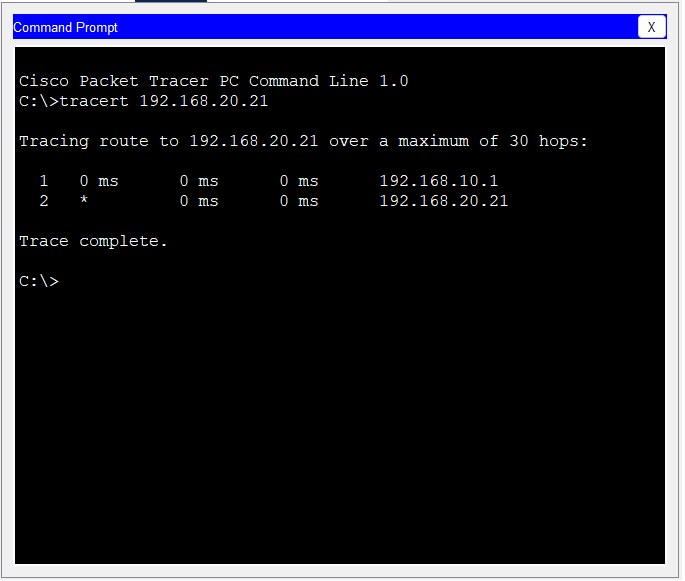
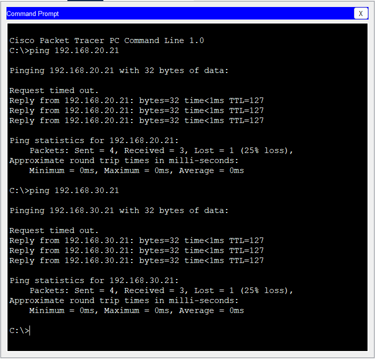

# Troubleshooting

## Objective

This document records the real troubleshooting process performed during the implementation of the Enterprise Network Lab.

Instead of presenting only the final configuration, this document explains how issues were identified, analyzed, and resolved using Cisco IOS verification commands.

Troubleshooting is an essential skill in enterprise networking because real-world deployments rarely work perfectly on the first attempt.

---

# Troubleshooting Methodology

The following workflow was used throughout the project:

1. Identify the problem.
2. Gather information.
3. Verify the current configuration.
4. Isolate the affected component.
5. Apply a correction.
6. Verify the solution.
7. Document the findings.

This structured approach reduces unnecessary configuration changes and helps isolate the root cause efficiently.

---

# Issue 1

## Problem

Inter-VLAN communication was not working correctly.

---

## Investigation

The following commands were used:

```bash
show interfaces trunk

show vlan brief

show ip interface brief
```

---

## Root Cause

The router subinterface for VLAN 40 was configured with an incorrect IP address.

Traffic destined for the IT VLAN could not be routed correctly.

---

## Resolution

The IP address was corrected to:

```text
192.168.40.1/24
```

---

## Verification

```bash
show ip interface brief

ping
```

Communication between VLANs was restored successfully.

---

# Issue 2

## Problem

Guest devices could not access internal VLANs.

---

## Investigation

Connectivity tests were performed using:

```bash
ping

tracert

show access-lists
```

---

## Root Cause

The behavior was expected.

An Extended ACL had been applied inbound on the Guest subinterface to block communication toward internal departments.

The ACL hit counters confirmed that traffic matched the deny statements.

---

## Resolution

No configuration changes were required.

The ACL functioned exactly as designed.

---

## Verification

```bash
show access-lists
```

Result:

- ACL matches increased.
- Guest traffic was blocked.
- Internal VLAN communication remained operational.

---

# Issue 3

## Problem

Initial trunk configuration required verification.

---

## Investigation

The following command was used:

```bash
show interfaces trunk
```

---

## Root Cause

The trunk configuration needed verification before Router-on-a-Stick could operate correctly.

---

## Resolution

Confirmed:

- IEEE 802.1Q encapsulation
- Trunk mode
- Allowed VLANs
- Active VLANs

---

## Verification

```bash
show interfaces trunk
```

All VLANs appeared in the forwarding state.

---

# Issue 4

## Problem

DHCP address assignment required validation.

---

## Investigation

The router DHCP database was inspected.

```bash
show ip dhcp binding
```

---

## Root Cause

No fault was detected.

The verification confirmed that clients successfully obtained addresses from the correct DHCP pools.

---

## Verification

```bash
show ip dhcp binding
```

All clients received valid IP addresses.

---

## Verification Evidence

### Traceroute



Figure 8 — Traceroute confirming the packet path through the router.

---

### Successful Inter-VLAN Ping



Figure 9 — Successful communication between different VLANs.

---

# Verification Commands Summary

| Command | Purpose |
|----------|----------|
| show vlan brief | Verify VLAN creation |
| show interfaces trunk | Verify trunk status |
| show ip interface brief | Verify router interfaces |
| show ip route | Verify routing table |
| show ip dhcp binding | Verify DHCP leases |
| show access-lists | Verify ACL operation |
| ping | Verify connectivity |
| tracert | Verify routing path |

---

# Lessons Learned

The project demonstrated that troubleshooting should always begin with verification rather than configuration changes.

Using Cisco IOS "show" commands provides valuable information that helps identify the root cause before making modifications.

A systematic troubleshooting process is faster, safer, and significantly more effective than changing configurations by trial and error.

---

# Best Practices

- Verify before changing configurations.
- Test one component at a time.
- Document every issue.
- Confirm the solution after each change.
- Keep configuration backups.
- Use verification commands frequently.

---

# References

- Cisco Troubleshooting Methodology
- Cisco Enterprise Campus Design Guide
- Cisco IOS Command Reference
