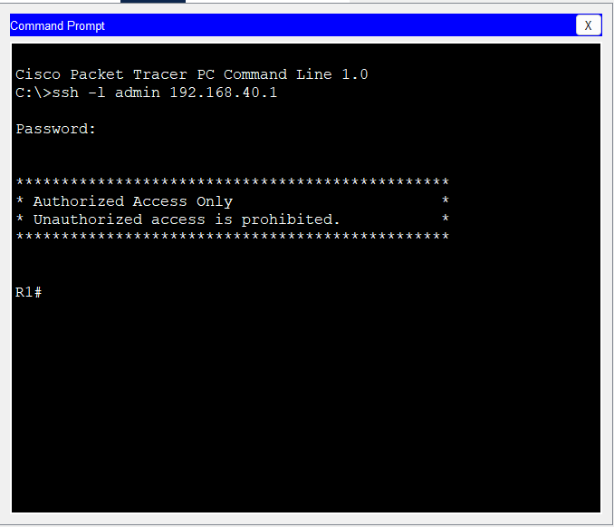
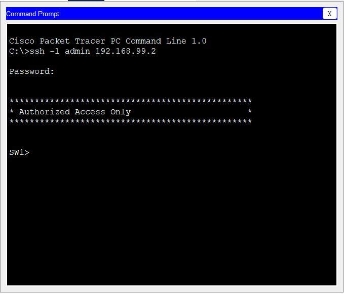

# SSH Management

## Objective

Configure secure remote management for network devices using SSH Version 2.

The objective is to replace insecure Telnet access with encrypted SSH sessions and restrict management access to authorized users only.

---

## Technologies Used

- SSH Version 2
- RSA Key Pair
- Local User Authentication
- Standard ACL
- VTY Configuration

---

## Security Design

The following security measures were implemented:

- SSH Version 2 enabled
- RSA encryption keys generated
- Local administrator account created
- Password encryption enabled
- Telnet disabled
- Access restricted to the IT department (VLAN 40)

Only authorized administrators can remotely manage the Router and Switch.

---

## Router Configuration

Configuration included:

- Hostname
- Domain Name
- Local Administrator
- RSA Key Generation
- SSH Version 2
- VTY Configuration
- ACL for Management Access

Management access is permitted only from:

192.168.40.0/24

---

## Switch Configuration

The same security configuration was applied to the Layer 2 Switch.

Remote management is available through SSH only.

Management Interface:

VLAN 99

Management IP:

192.168.99.2

---

## Verification

The following tests were successfully completed.

| Test | Result |
|------|--------|
| SSH to Router from IT PC | ✅ Success |
| SSH to Switch from IT PC | ✅ Success |
| SSH from CEO VLAN | ❌ Blocked |
| Telnet Access | ❌ Disabled |

---

## Commands Used

Router

```cisco
show ip ssh

show crypto key mypubkey rsa

show access-lists

show running-config | section line vty
```

Switch

```cisco
show ip ssh

show crypto key mypubkey rsa

show access-lists

show ip interface brief
```

---

## Screenshots





---

## Result

Secure remote administration has been successfully implemented.

Management traffic is encrypted using SSH Version 2.

Administrative access is restricted to the IT department through Access Control Lists (ACLs).

This configuration follows common enterprise networking best practices.