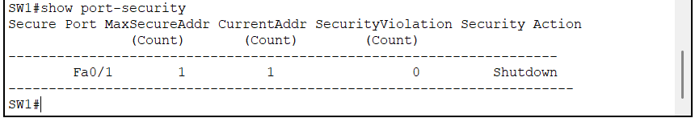
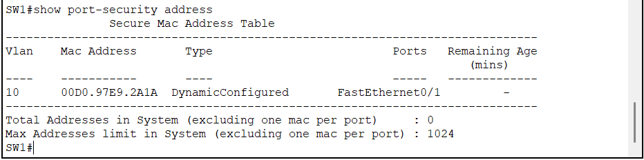
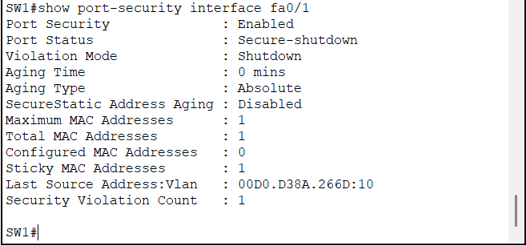
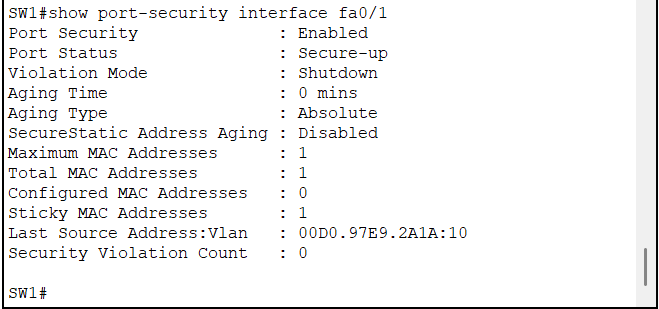

# Port Security

## Objective

This document explains how Cisco Port Security was implemented to protect the enterprise network against unauthorized devices connected to access ports.

Port Security limits the number of allowed MAC addresses on a switch port and automatically blocks unauthorized devices.

---

## Why Port Security?

Without Port Security, anyone can disconnect a company workstation and connect another device to the network.

Port Security mitigates this risk by allowing only trusted devices to use designated switch ports.

Benefits include:

- Preventing unauthorized network access
- Protecting against MAC flooding attacks
- Limiting physical access abuse
- Automatically disabling compromised ports

---

## Configuration

Port Security was configured on access ports using Sticky MAC learning.

Example configuration:

```cisco
interface FastEthernet0/1
 switchport mode access
 switchport access vlan 10
 switchport port-security
 switchport port-security maximum 1
 switchport port-security mac-address sticky
 switchport port-security violation shutdown
```

### Configuration Explanation

| Command | Purpose |
|---------|----------|
| `switchport port-security` | Enables Port Security |
| `maximum 1` | Allows only one device |
| `mac-address sticky` | Learns the first MAC address automatically |
| `violation shutdown` | Disables the port when a violation occurs |

---

## Sticky MAC Learning

When the authorized workstation connected to the port generated traffic, the switch automatically learned and saved its MAC address.

Verification command:

```cisco
show port-security address
```

The learned MAC became the only trusted device for that interface.

---

## Attack Simulation

An unauthorized workstation was connected to the same switch port after disconnecting the original workstation.

Because the MAC address differed from the learned Sticky MAC, Port Security detected a security violation.

The switch immediately placed the interface into the **err-disabled (Secure-Shutdown)** state.

Verification:

```cisco
show port-security interface fa0/1
```

---

## Recovery Procedure

To restore the interface:

1. Remove the learned Sticky MAC address.
2. Shutdown the interface.
3. Bring the interface back online.
4. Allow the new authorized device to generate traffic.

Example:

```cisco
interface FastEthernet0/1

no switchport port-security mac-address sticky <OLD_MAC>

shutdown

no shutdown
```

After recovery, the switch learned the new Sticky MAC automatically.

---

## Verification

The following verification commands were used:

```cisco
show port-security

show port-security interface fa0/1

show port-security address

show interface fa0/1
```

Successful verification confirmed:

- Port Security enabled
- Sticky MAC learned
- Security violation detected
- Interface entered Secure-Shutdown
- Successful recovery after administrator intervention

---

## Lessons Learned

This lab demonstrates how Cisco switches can automatically protect enterprise access ports.

Key takeaways:

- Sticky MAC simplifies deployment.
- Shutdown mode provides strong protection.
- Administrators must manually recover ports after violations.
- Packet Tracer may require removing the learned Sticky MAC explicitly before recovery.

---

## Screenshots

### Port Security Enabled



---

### Sticky MAC Learned



---

### Security Violation



---

### Interface in Err-Disabled State


---

### Port Recovery



---

## References

- Cisco Secure Campus Design Guide
- Cisco Catalyst Switch Security Configuration Guide
- Cisco Port Security Best Practices