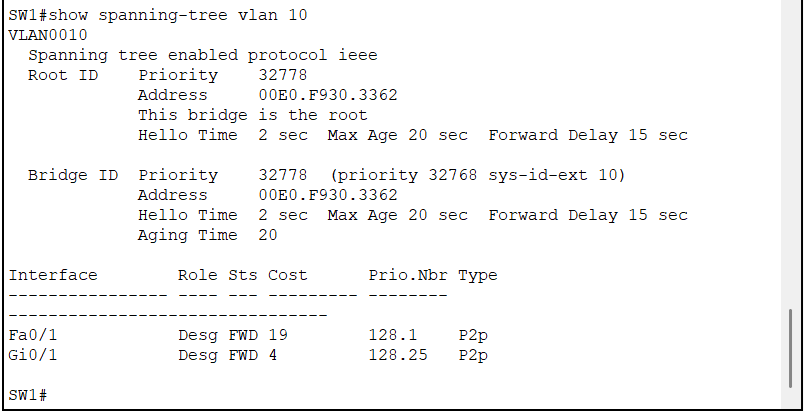
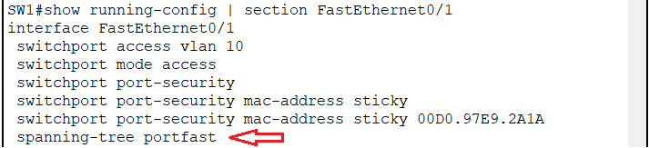
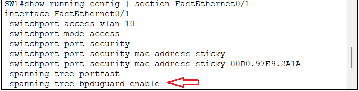
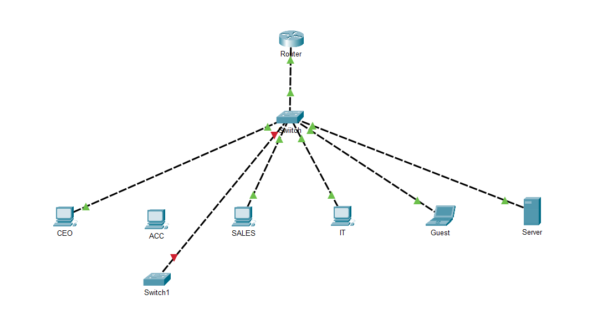
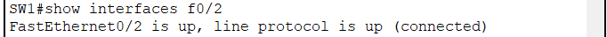

# Spanning Tree Protocol (STP)

## Objective

This document explains the implementation of Spanning Tree Protocol (STP), PortFast, and BPDU Guard in the enterprise network.

The objective is to prevent Layer 2 loops while protecting access ports against unauthorized switches.

---

## Overview

Spanning Tree Protocol (STP) is a Layer 2 protocol that prevents switching loops by creating a loop-free topology.

Without STP, redundant links could cause:

- Broadcast storms
- MAC address table instability
- Multiple frame copies
- Network outages

---

## Current Topology

The current lab contains a single Cisco Catalyst 2960 switch.

Since only one switch exists, SW1 automatically becomes the Root Bridge for all VLANs.

Verification command:

```text
show spanning-tree vlan 10
```

---

## PortFast

PortFast was enabled on all access ports connected to end devices.

Configured interfaces:

- FastEthernet0/1
- FastEthernet0/2
- FastEthernet0/3
- FastEthernet0/4
- FastEthernet0/5

Configuration:

```cisco
interface range fa0/1 - 5
 spanning-tree portfast
```

### Why PortFast?

Normally, STP places a port into Listening and Learning states before forwarding traffic.

PortFast allows access ports to transition immediately to the Forwarding state, reducing client startup time.

> PortFast does **not** disable STP.

---

## BPDU Guard

BPDU Guard was enabled on all PortFast interfaces.

Configuration:

```cisco
interface range fa0/1 - 5
 spanning-tree bpduguard enable
```

If a BPDU is received on a PortFast-enabled interface, the switch immediately places that port into the **err-disabled** state.

This protects the network against accidental or unauthorized switch connections.

---

## Verification Commands

```text
show spanning-tree vlan 10
show interface fa0/2
show running-config | section FastEthernet0/1
```

---

## Test Scenario

A second switch was connected to an access port protected by BPDU Guard.

Result:

- BPDU received
- Interface entered err-disabled state
- Rogue switch disconnected automatically

Recovery procedure:

```cisco
interface fa0/2
 shutdown
 no shutdown
```

---

## Screenshots

### STP Root Bridge

The following output confirms that SW1 is the Root Bridge for VLAN 10.



---

### PortFast Configuration

PortFast was enabled on all access ports connected to end devices.



---

### BPDU Guard Configuration

BPDU Guard was enabled on all PortFast interfaces to protect the network against unauthorized switches.



---

### BPDU Guard Violation

Connecting another switch to an access port caused the interface to enter the **err-disabled** state.


---

### Err-disabled Interface

The interface status confirms that BPDU Guard successfully disabled the port after receiving a BPDU.



---

### Interface Recovery

After removing the unauthorized switch, the interface was restored using the shutdown/no shutdown procedure.



---

## Lessons Learned

PortFast improves host connectivity by eliminating unnecessary STP delays on access ports.

BPDU Guard complements PortFast by protecting the network from accidental Layer 2 loops caused by unauthorized switches.

Together, these features significantly improve the security and stability of enterprise access networks.