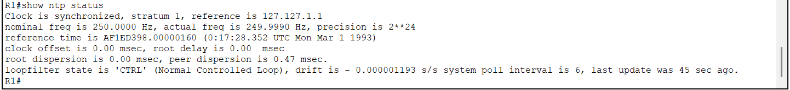

# Network Time Protocol (NTP)

## Objective

This document describes the implementation of Network Time Protocol (NTP) within the Enterprise Network Lab.

The objective is to provide consistent time synchronization across network devices, improving log accuracy, troubleshooting, monitoring, and future infrastructure integration.

---

## Background

Accurate system time is essential in enterprise environments.

Many services rely on synchronized clocks, including:

- Syslog
- Active Directory
- DNS
- Authentication Services
- Monitoring Systems
- Security Auditing

Without synchronized time, troubleshooting becomes significantly more difficult because log timestamps cannot be correlated across devices.

---

## NTP Design

The router acts as the internal NTP Master.

The Layer 2 switch synchronizes its clock with the router.

```
        +----------------------+
        |      R1 Router       |
        |   NTP Master         |
        |   Stratum 1          |
        +----------+-----------+
                   |
                   |
            Management VLAN 99
                   |
        +----------+-----------+
        |      SW1 Switch      |
        |   NTP Client         |
        |   Stratum 2          |
        +----------------------+
```

This design provides a centralized and consistent time source for all current and future network devices.

---

## Configuration

### Router Configuration

```cisco
conf t

clock timezone IRT 3 30

ntp master 1

end

wr
```

---

### Switch Configuration

```cisco
conf t

clock timezone IRT 3 30

ntp server 192.168.99.1

end

wr
```

---

## Verification

### Router

```
show ntp status
```

Expected result:

- Clock synchronized
- Stratum 1

---

### Switch

```
show ntp status
```

Expected result:

- Clock synchronized
- Stratum 2
- Reference: 192.168.99.1

---

### Verify Running Configuration

```
show running-config | include ntp
```

---

### Verify System Time

```
show clock
```

The switch should display the synchronized local time using the configured time zone.

---

## Design Decisions

### Why use the Router as the NTP Master?

In this lab environment, the router provides a centralized internal time source for all network devices.

In production environments, routers typically synchronize with external public or enterprise NTP servers and then distribute time internally.

This approach minimizes external dependencies while maintaining accurate and consistent timestamps throughout the network.

---

### Why configure a Time Zone?

NTP synchronizes devices using Coordinated Universal Time (UTC).

Configuring the local time zone allows administrators to read logs using local time without affecting synchronization accuracy.

---

## Benefits

Implementing NTP provides several operational advantages:

- Accurate log timestamps
- Easier troubleshooting
- Consistent monitoring data
- Reliable event correlation
- Improved infrastructure management
- Foundation for future enterprise services

---

## Screenshots

### Router NTP Master



---

### Router NTP Configuration


---

### Switch NTP Configuration


---

### Switch Synchronization Status


---

### Synchronized Clock


---

## Lessons Learned

Network Time Protocol is a foundational service in enterprise networks.

Even a small network benefits from synchronized clocks because accurate timestamps improve troubleshooting, auditing, monitoring, and operational reliability.

Deploying a centralized NTP source prepares the infrastructure for future services such as Syslog servers, Windows Active Directory, monitoring platforms, and security systems.

---

## References

- Cisco IOS Network Time Protocol Configuration Guide
- RFC 5905 – Network Time Protocol Version 4