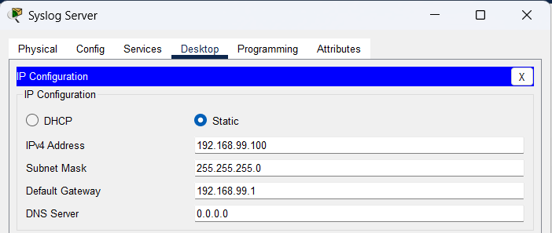
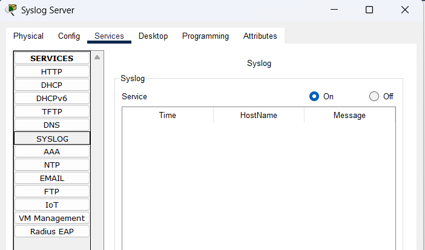
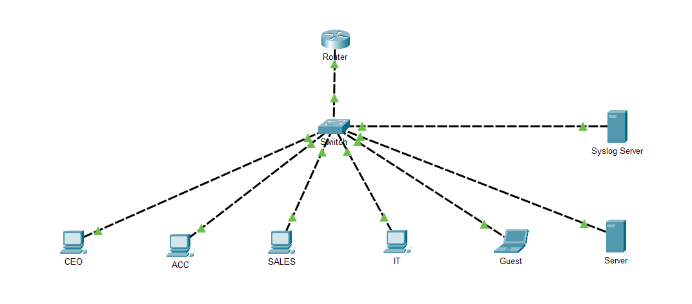
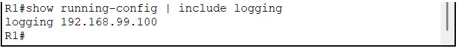
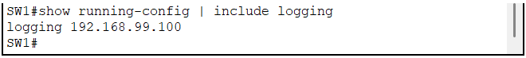
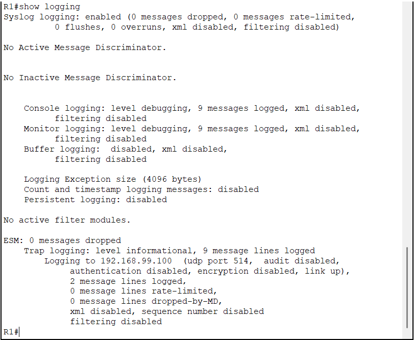
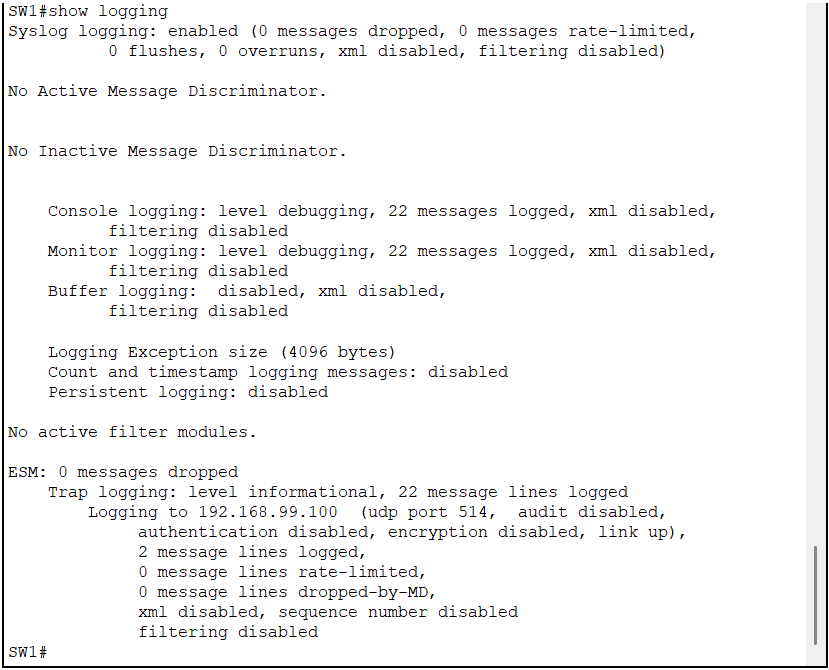
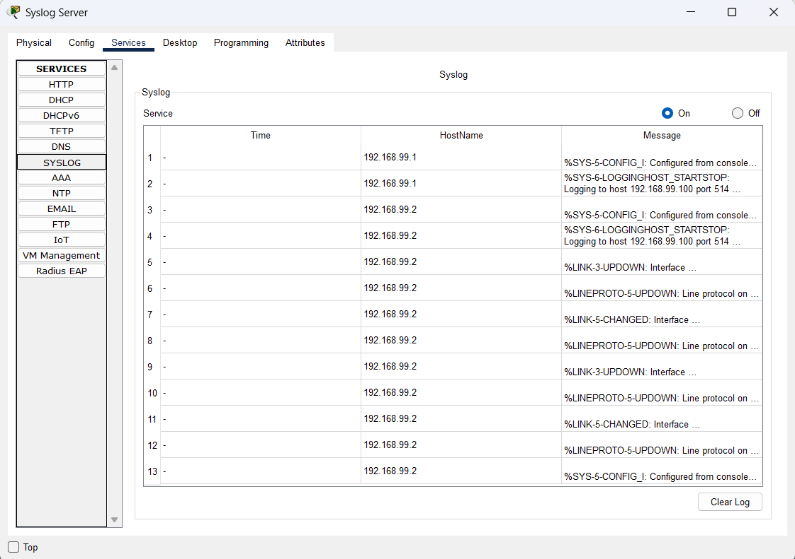

# Centralized Syslog

## Objective

This document describes the implementation of centralized Syslog logging for the Enterprise Network Lab.

Centralized logging allows network administrators to collect, monitor, and troubleshoot events generated by network devices from a single location.

---

## Why Syslog?

Without centralized logging, administrators must manually access each network device to review log messages.

Using a Syslog server provides several advantages:

- Centralized event collection
- Easier troubleshooting
- Historical log retention
- Security event monitoring
- Faster incident response

In this project, both the router and the switch forward log messages to a dedicated Syslog server located in the Management VLAN.

---

## Network Design

The Syslog server is connected to the Management VLAN.

| Device | IP Address | Role |
|---------|------------|------|
| R1 | 192.168.99.1 | Syslog Client |
| SW1 | 192.168.99.2 | Syslog Client |
| Syslog Server | 192.168.99.100 | Central Log Collector |

---

## Syslog Server Configuration

The Packet Tracer Server device was configured with the following settings:

| Setting | Value |
|---------|-------|
| IP Address | 192.168.99.100 |
| Subnet Mask | 255.255.255.0 |
| Default Gateway | 192.168.99.1 |
| Syslog Service | Enabled |

---

## Router Configuration

The router forwards log messages to the Syslog server.

```cisco
service timestamps log datetime msec localtime

logging buffered 16384 debugging

logging trap informational

logging host 192.168.99.100
```

---

## Switch Configuration

The switch uses the same centralized logging configuration.

```cisco
service timestamps log datetime msec localtime

logging buffered 16384 debugging

logging trap informational

logging host 192.168.99.100
```

---

## Verification

The following verification commands were used.

### Router

```cisco
show logging

show running-config | include logging
```

### Switch

```cisco
show logging

show running-config | include logging
```

Both devices successfully transmitted log messages to the Syslog server.

---

## Generated Events

The following events were generated to verify logging functionality.

- Interface shutdown
- Interface no shutdown
- Configuration changes
- Link state changes
- Line protocol changes

Each event appeared successfully on the centralized Syslog server.

---

## Packet Tracer Notes

Cisco Packet Tracer supports basic Syslog functionality.

Some IOS logging features such as buffered logging status, timestamp display, and message counters are simplified compared to real Cisco IOS devices.

Although these limitations exist, centralized Syslog forwarding operates correctly and accurately demonstrates the enterprise logging workflow.

---

## Screenshots

### Server IP Configuration



---

### Syslog Service



---

### Syslog Server Topology



---

### Router Logging Configuration



---

### Switch Logging Configuration



---

### Router Verification



---

### Switch Verification



---

### Centralized Syslog Events



---

## Design Decisions

A dedicated Syslog server was placed inside the Management VLAN to separate management traffic from user traffic.

Using centralized logging improves visibility across the network and prepares the infrastructure for future monitoring systems such as Zabbix or Grafana.

---

## Lessons Learned

Implementing centralized Syslog demonstrated the importance of collecting logs from multiple devices in a single location.

Combined with NTP synchronization, log timestamps become meaningful and allow administrators to reconstruct network events accurately.

This feature also lays the foundation for future monitoring, alerting, and security analysis.

---

## References

- Cisco IOS System Message Guide
- RFC 5424 — The Syslog Protocol
- Cisco Enterprise Network Design Guide