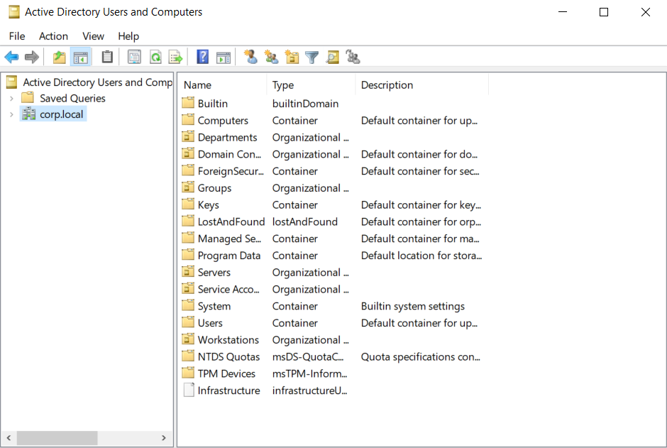
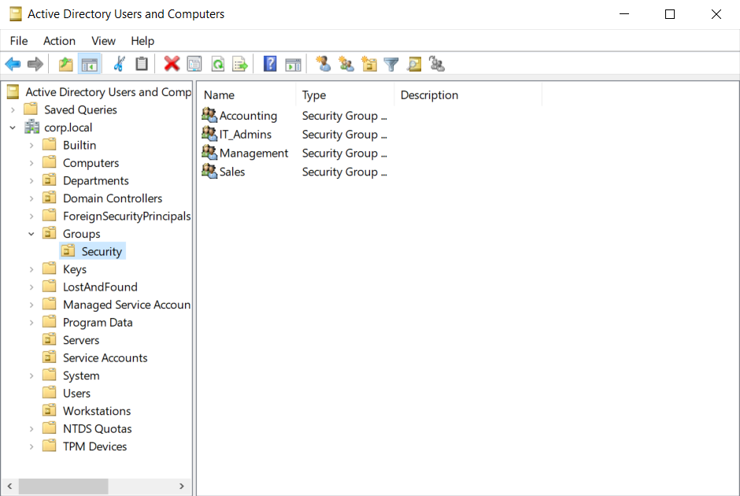
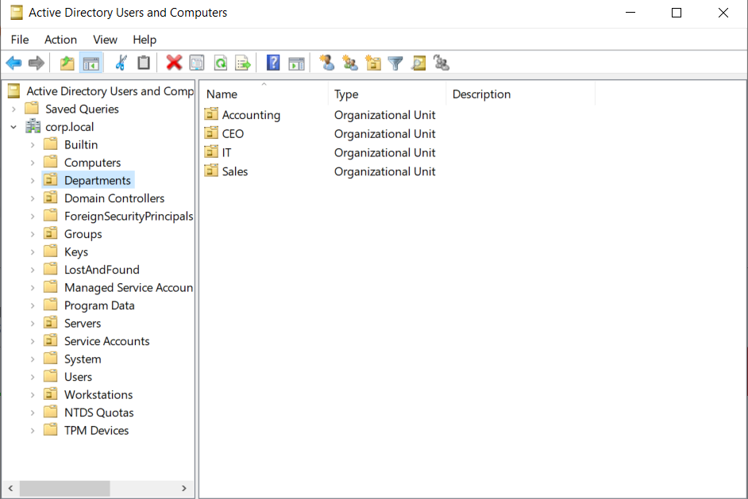
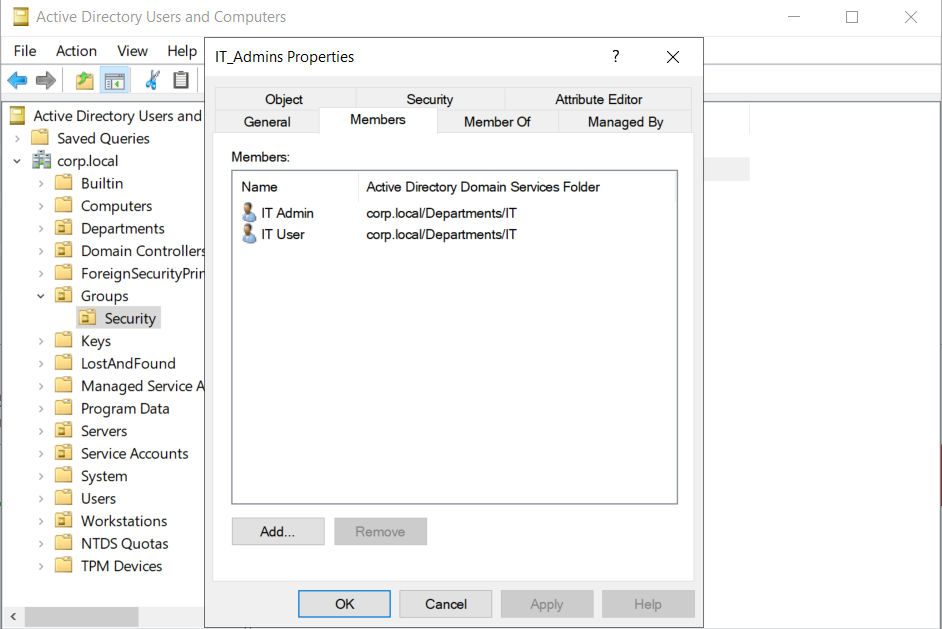
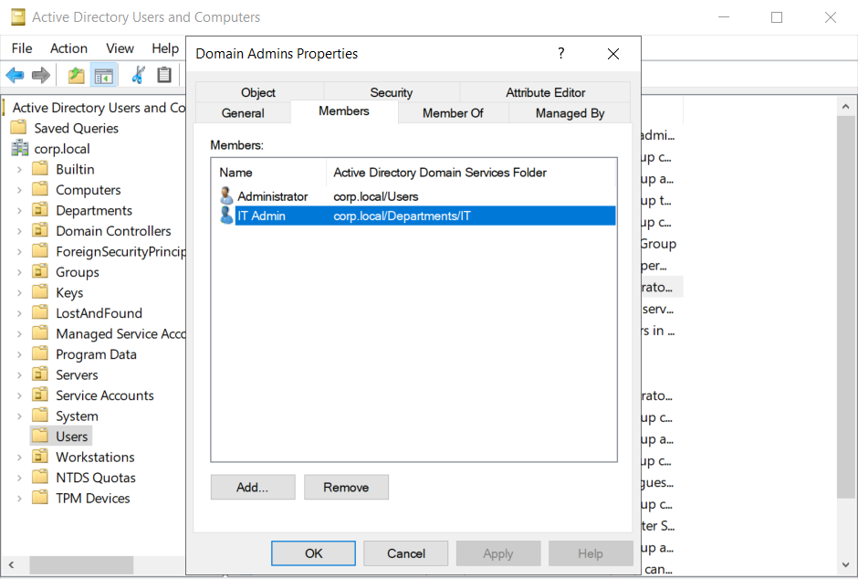
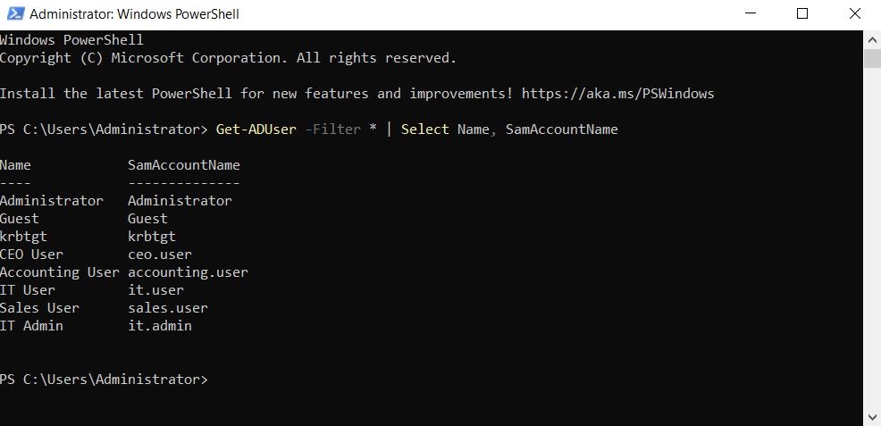
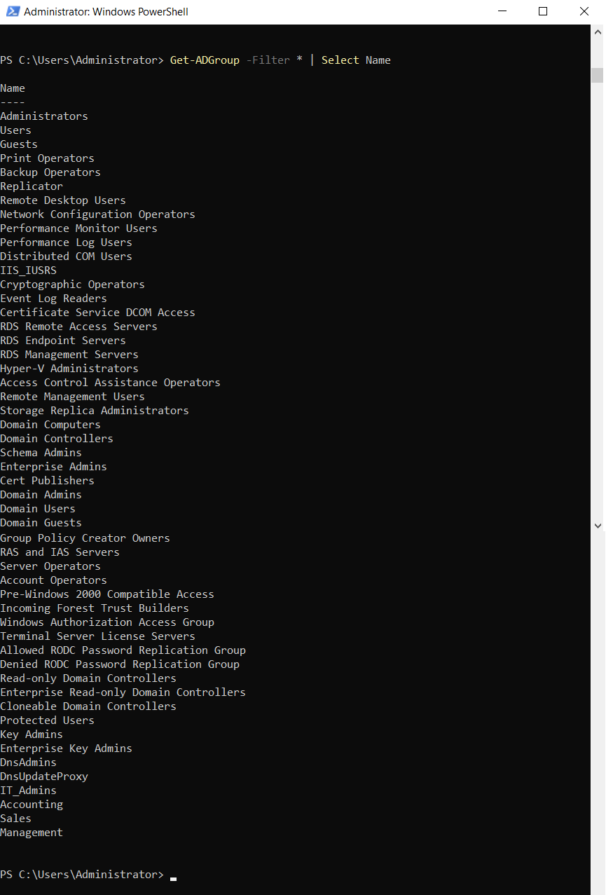
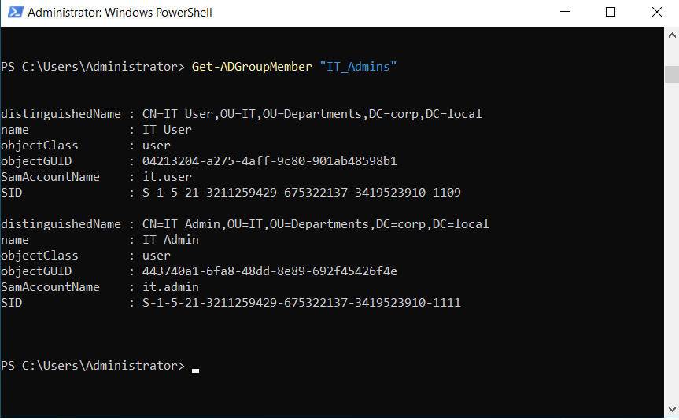
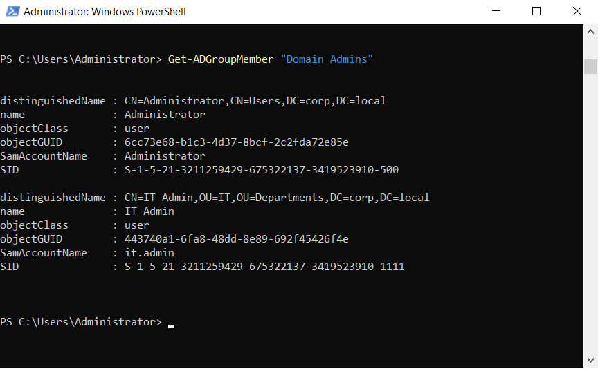

# Active Directory Administration

## Overview

This document describes the organizational structure implemented within the Active Directory domain, including Organizational Units (OUs), Security Groups, user accounts, and delegated administrative accounts.

---

## Objectives

- Create a structured Organizational Unit hierarchy
- Separate users by department
- Implement Security Groups
- Create standard user accounts
- Create a dedicated administrative account
- Follow Microsoft Active Directory best practices

---

## Organizational Unit Structure

The following Organizational Units were created:

- Servers
- Workstations
- Departments
  - CEO
  - Accounting
  - Sales
  - IT
- Groups
  - Security
- Service Accounts

### Screenshot

---

## Security Groups

The following Global Security Groups were created:

- IT_Admins
- Management
- Accounting
- Sales

Each group is used to simplify permission management and follows Microsoft's AGDLP model.

### Screenshot

---

## User Accounts

The following users were created:

| User | Department |
|------|------------|
| ceo.user | CEO |
| accounting.user | Accounting |
| sales.user | Sales |
| it.user | IT |
| it.admin | IT |

Users were placed inside their corresponding Organizational Units.

### Screenshot

---

## Group Membership

Users were added to their corresponding Security Groups.

| User | Group |
|------|-------|
| ceo.user | Management |
| accounting.user | Accounting |
| sales.user | Sales |
| it.user | IT_Admins |
| it.admin | IT_Admins |

### Screenshot

---

## Administrative Account

A dedicated administrative account (it.admin) was created.

The account was added to the Domain Admins group to follow security best practices by avoiding daily use of the built-in Administrator account.

### Screenshot

---

## Verification

PowerShell commands used:

Get-ADUser -Filter *

Get-ADGroup -Filter *

Get-ADGroupMember "IT_Admins"

Get-ADGroupMember "Domain Admins"

### Screenshots

---

## Summary

The Active Directory environment now includes a structured Organizational Unit hierarchy, departmental user accounts, Security Groups, and a dedicated administrative account. This structure provides a scalable foundation for future implementations such as Group Policy, Windows client domain join, file services, and enterprise resource management.