# Windows 11 Domain Join

## Overview

This document describes the process of joining a Windows 11 client to the Active Directory domain, verifying domain authentication, and validating communication with the Domain Controller.

---

## Objectives

- Configure a Windows 11 client
- Configure DNS to use the Domain Controller
- Join the client to the Active Directory domain
- Verify successful domain authentication
- Verify the computer object in Active Directory
- Validate domain membership using PowerShell

---

## Network Configuration

The Windows 11 client was configured with the following settings:

| Setting | Value |
|---------|-------|
| IP Address | 192.168.99.20 |
| Subnet Mask | 255.255.255.0 |
| Default Gateway | 192.168.99.1 |
| DNS Server | 192.168.99.10 |

### Screenshot

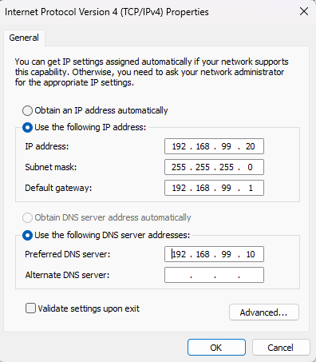

---

## Connectivity Verification

The following commands were executed:

```cmd
ipconfig /all
ping 192.168.99.10
ping corp.local
nslookup corp.local
```

### Screenshots

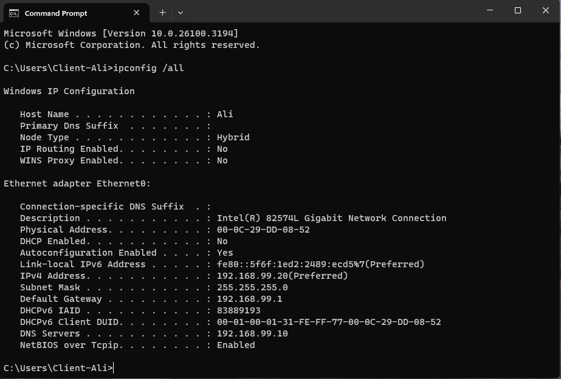

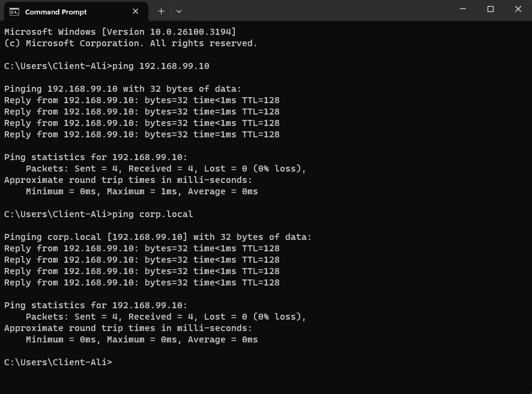

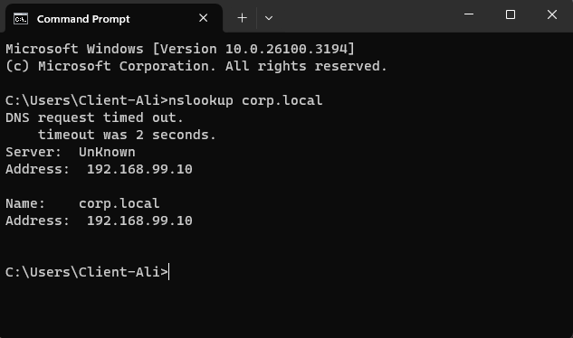

---

## Domain Join

The Windows 11 client was successfully joined to the **corp.local** domain using the dedicated administrative account.

### Screenshots

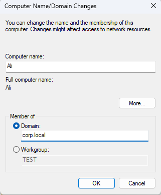

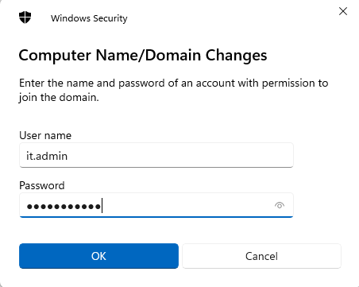

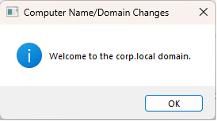

---

## Domain Authentication

After restarting, the client successfully authenticated against the Active Directory domain.

### Screenshot

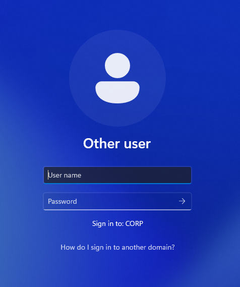

---

## Verification

Verification commands:

```cmd
whoami
echo %LOGONSERVER%
echo %USERDOMAIN%
hostname
```

### Screenshot

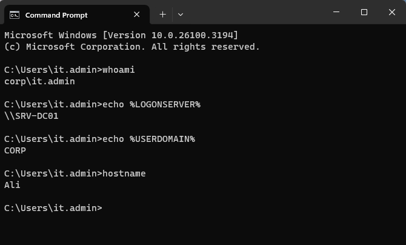

---

## Active Directory Verification

The computer account was successfully created in Active Directory.

PowerShell verification:

```powershell
Get-ADComputer -Filter *
```

### Screenshots

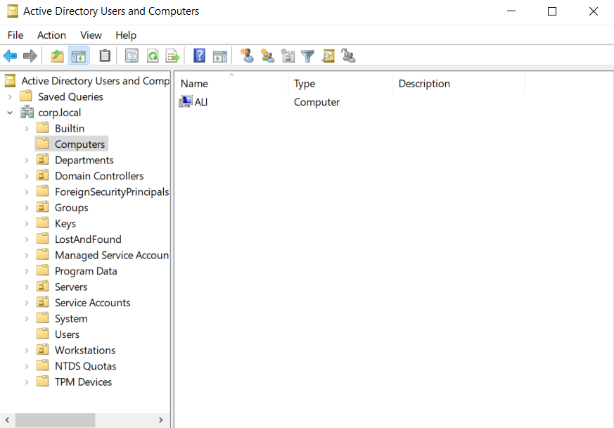

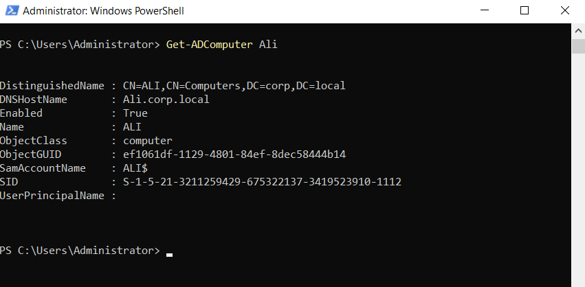

---

## Summary

The Windows 11 client successfully joined the **corp.local** Active Directory domain. Domain authentication, DNS resolution, and Active Directory computer object creation were verified. This provides the foundation for centralized policy management, software deployment, and enterprise workstation administration.